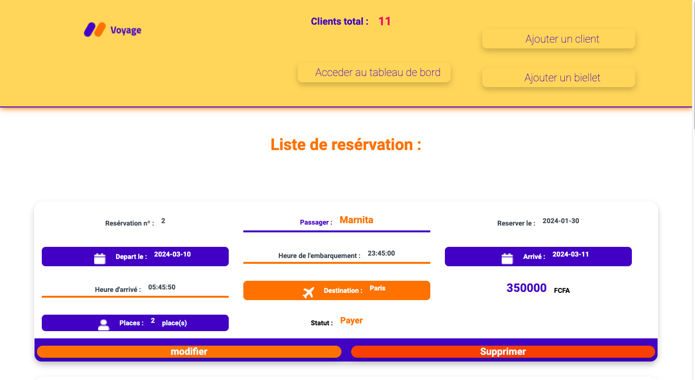
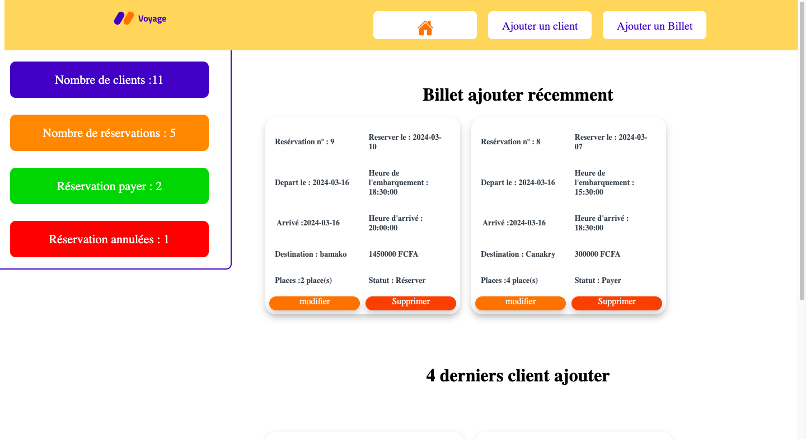
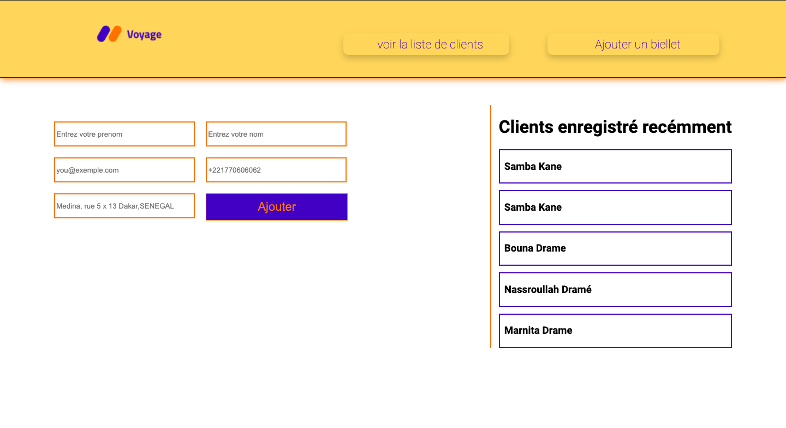
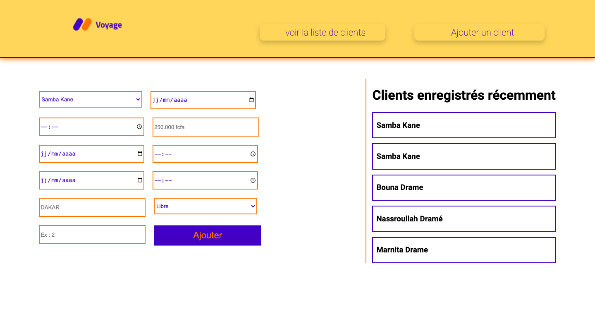
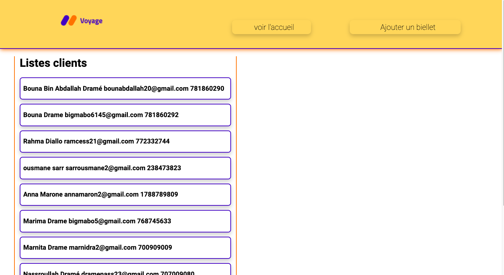

# Projet Gestion de réservation de billets
Ce projet est une application web permettant á administrateur, d'eregistré, modifier et supprimer des réservation. Il comporte une page d'accueil oú on vois l'enseble de réservation, un page detail pour les details d'un client, une page pour la liste de clients, une page pour ajouter un client, une pour ajouter un billet et un tableau de bord oú on vois l'ensemble de nos données de la plateforme.
## Technologies utilisées
- HTML
- CSS
- PHP 8.2.9
- MySQL 8.3.0
## Fonctionnalités clés
- Création, modification et suppression une reservation.
## Installation
1. Cloner ce dépôt dans votre serveur web local.
2. Importer la base de données fournie (`Application_de_gestion__de_billets_2024-03-05_120533.sql`) dans votre système de gestion de base de données MySQL.
3. Configurer les informations de connexion à la base de données dans le fichier `config.php`.
4. Assurez-vous que votre environnement PHP est configuré avec PHP version 8.2.9 ou supérieure et MySQL version 8.3.0.

## Captures d'écran
(--\/\/\/\/\/\/--)

1. page accueil : 

2. Dashboard :

3. Ajout client  :

4. Ajout billet :

5. List client :

## Comment utiliser
1. Accédez à l'application depuis votre navigateur web.
4. Une fois dans votre navigateur web, vous pouvez enregistrer des nouveaux utilisateurs et billets et vous pouvez les modifier ou les supprimer selon vos besoins.
---
Ce README.md fournit une vue d'ensemble du Projet :
# Gestion de réservation de billets

## Auteur
[Bouna Bin Abdallah Dramé]
